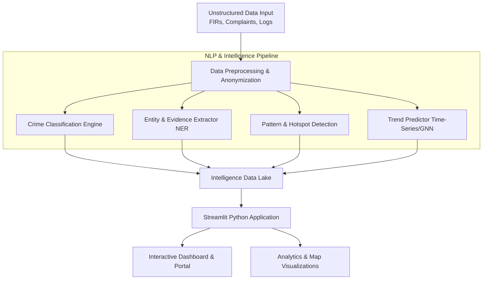

# CRIS (Crime Report Intelligence System) - Project Roadmap & Architecture

This document serves as the complete pathway from scratch to research-paper readiness for the AI-driven CRIS project.

## 1. Project Overview & Research Goals
**Objective:** To develop a robust, scalable AI platform that automatically processes unstructured crime reports (FIRs, incident narratives, etc.) into actionable intelligence.
**Research Contribution:** Evaluating and optimizing NLP models (like Transformers/LLMs) for specific forensic/legal linguistics tasks, specifically focusing on crime classification, custom Named Entity Recognition (NER), pattern detection, and spatiotemporal crime prediction.

---

## 2. High-Level System Architecture

### Component Breakdown:
*   **Application Framework:** Streamlit (unified frontend & backend for rapid prototyping, interactive maps with Folium, and NLP dashboards).
*   **Database Engine:** 
    *   Relational DB (PostgreSQL) for structured fields.
    *   Vector DB (Milvus, Pinecone, or pgvector) for storing embeddings and semantic search.
*   **ML Frameworks:** PyTorch, Hugging Face `transformers`, spaCy, Scikit-learn.

---

## 3. Step-by-Step Implementation Roadmap

### Phase 1: Data Preparation & Exploratory Data Analysis (EDA) (Weeks 1-2)
*   **Dataset Ingestion:** Load your 60k synthetic dataset (42 fields, 7 groups).
*   **Data Cleaning:** Handle missing values, normalize text (lowercasing, punctuation removal), and check for class imbalances across the 42 fields.
*   **Text Preprocessing:** Tokenization, stop-word removal, and stemming/lemmatization.
*   **Exploratory Data Analysis:** Visualize crime distributions, common entities, and text length distributions.

### Phase 2: NLP Pipeline Development (Weeks 3-5)
*   **Crime Classification:** 
    *   Train/Fine-tune models (RoBERTa, LegalBERT, or DistilBERT) to categorize reports into specific crime types. 
    *   *Metric:* F1-score, Precision, Recall.
*   **Entity & Evidence Extraction (NER):**
    *   Train a custom NER model using spaCy or token-classification transformers to extract: `Suspect Name`, `Victim`, `Location`, `Weapon`, `Vehicle Plate`, etc.
*   **Pattern & Hotspot Detection:**
    *   Use Topic Modeling (BERTopic, LDA) to cluster similar but uncategorized crimes.
    *   Extract geolocation entities for density mapping (Hotspots).

### Phase 3: Trend Prediction & Advanced Analytics (Weeks 6-7)
*   **Time-Series Analysis:** Use the temporal data (dates, times from the 42 fields) alongside categories to map crime trends over time.
*   **Predictive Modeling:** Use models like ARIMA, Prophet, or LSTM to forecast crime likelihood in specific regions based on historical synthetic data.

### Phase 4: System Integration (Weeks 8-9)
*   Develop a **Streamlit** application to integrate the ML models directly with the UI without needing external REST APIs.
*   Build interfaces to input a raw police report and instantly display the classified category, extracted NER entities, and pattern matches.
*   Create interactive dashboards (e.g., using Plotly and Folium maps) for temporal trend analysis and mapping hotspots.
*   Connect the NLP pipeline and Streamlit App to the Vector/Relational Databases.

### Phase 5: Evaluation & Optimization (Week 10)
*   Measure latency and throughput of the system.
*   Optimize NLP models (quantization, ORT, ONNX) for faster inference, which is crucial for a scalable system.
*   Perform ablation studies (checking how each component of your pipeline adds value to the end result).

---

## 4. Research Paper Publication Pathway

To make this project "Research Paper Ready," you must frame the development as a scientific experiment.

### A. Literature Review & Problem Formulation
*   **Identify the Gap:** Search IEEE Xplore, Springer, and arXiv for existing "Crime Analysis using NLP". Many rely on basic ML; your use of advanced Transformers or a comprehensive 60k multi-variable synthetic dataset is your novelty.
*   **Formulate Research Questions (RQs):**
    *   *RQ1:* How do domain-specific language models compare in extracting forensic entities from unstructured FIRs versus general-purpose models?
    *   *RQ2:* Can the integration of spatial data and NLP improve the accuracy of crime hotspot prediction?

### B. Methodology Documentation
*   Thoroughly document the synthetic data generation process (how the 60k rows/42 fields were synthesized and validated for realism). 
*   Detail the architecture and hyperparameter configurations of your chosen models.

### C. Experiments and Results Analysis
*   Create clear, comparative tables: e.g., Model A vs Model B on Crime Classification Accuracy.
*   Show visualizations: Confusion matrices, NER extraction examples, and geographical hotspot maps.

### D. Writing the Paper (Structure)
1.  **Abstract:** Summary of the problem, your system (CRIS), and top-line results.
2.  **Introduction:** Motivation (Law enforcement needs), problem statement, contributions.
3.  **Related Work:** Review of prior NLP in criminology.
4.  **Dataset:** Detail your 60k dataset (crucial for synthetic dataset validation).
5.  **Methodology/System Architecture:** Explain the CRIS architecture.
6.  **Experiments & Results:** Evaluation metrics (F1, Precision) and performance comparisons.
7.  **Discussion:** Limitations and real-world applicability.
8.  **Conclusion & Future Work.**

### E. Target Journals & Conferences
*   **Conferences:** ACL, EMNLP, COLING (if deeply NLP focused), or IEEE ISI (Intelligence and Security Informatics).
*   **Journals:** Expert Systems with Applications, IEEE Transactions on Computational Social Systems, Forensic Science International: Digital Investigation.
